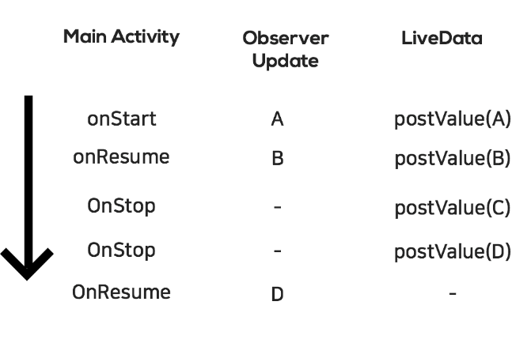

# Live data

수명 주기를 인식할 수 있는 관찰가능한 홀더 클래스. 액티비티, 프래그먼트, 서비스 같은 앱 구성요소의 수명 주기를 고려합니다.

관찰자(Observer)의 수명 주기가 STARTED, RESUMED 상태이면 라이브데이터는 관찰자를 활성화 상태로 인식하고, DESTROYED가 되면 관찰자를 삭제합니다.

## 라이브데이터를 쓰면 무엇이 좋은가?

기존 : Presenter에서 변경되는 데이터를 뷰에 반영하기 위해서는 프리젠터에서 뷰의 함수를 호출하여 반영하였습니다. view가 없는 경우(destroy)는 null 체크를 하여 함수가 실행되지 않게끔했습니다.

또는 Listener를 달아서, 데이터가 변경 될때, 뷰의 요소가 함께 변경되게끔 하였습니다.



라이브 데이터는 데이터가 변경될때 수명 주기에 따라서 뷰를 갱신할지 안할지 자동으로 결정됩니다.

이에따른 이점으로

1. UI와 데이터 상태의 일치 보장
2. 메모리 누수 없음 : 수명주기가 끝나면 자동으로 삭제됩니다.
3. 중지된 액티비티로 인한 비정상 종료 없음 : 수명주기에 따라 데이터를 전달하기 때문에 액티비티가 종료되어도 ANR이 발생하지 않습니다.
4. 수명주기를 수동으로 처리하지 않음
5. **최신 데이터** 유지 : 액티비티가 onStop일때 데이터가 변경되어도 onResume 상태가 되면 최신 데이터를 불러옵니다.
6. 적절한 구성 변경 : 화면을 회전하거나 새롭게 구성되어도 라이브데이터에서 최신 데이터를 불러옵니다.
7. 리소스 공유

결론은 수명주기로 인해 추가되는 코드들을 줄일 수 가 있습니다.

### Live data transformation

RxJava Observable의 연산자 같은 느낌으로 LiveData를 다루는 함수입니다.

- map : 라이브 데이터의 변경을 다른 라이브 데이터에게 알려주는 메소드입니다.

    ```kotlin
    val liveData: LiveData = ...
    val newLiveData = Transformations.map(liveData, data -> {
        return "data : " + data // String 리턴
    })
    ```

- switchMap : LivaData를 변경하여 다른 LiveData를 발행합니다.

    ```kotlin
    val liveData : MutableLiveData = ...
    val newLiveData : LiveData = Transformations.switchMap(liveData, uid->
        userRepo.get(uid)) // LiveData 리턴

    fun setUserId(userId : String) {
        this.liveData.setValue(userId)
    }
    ```

- MediatorLiveData : 여러 데이터 소스를 한곳에거 Observe할때 사용합니다.

    ```kotlin
    val liveData1: LiveData = ...
    val liveData2: LiveData = ...

    val liveDataMerger:MediatorLiveData = MediatorLiveData<>()
     liveDataMerger.addSource(liveData1, value -> liveDataMerger.setValue(value))
     liveDataMerger.addSource(liveData2, value -> liveDataMerger.setValue(value))
    ```

### 간단한 예제

```kotlin
liveText.observe(this, {
            binding.tvNum.text = it
        })

binding.btAdd.setOnClickListener {
            count++
            liveText.value = count.toString()
        }
```

### ViewModel 사용 예제

MainActivity.kt

```kotlin
private lateinit var model : MainViewModel

override fun onCreate(savedInstanceState: Bundle?) {
    ...
    model = ViewModelProvider(this).get(MainViewModel::class.java)

    model.post.observe(this, {
        post -> binding.tvNum.text = post
    })

    binding.btAdd.setOnClickListener {
        model.addValue()
    }
    ...
}
```

MainViewModel.kt

```kotlin
class MainViewModel : ViewModel() {
    private val post : MutableLiveData<String> by lazy {
        MutableLiveData<String>()
    }

    private var count = 1

    fun addValue(){
        post.value = count++.toString()
    }
}
```

라이브데이터는 **ViewModel, DataBinding**과 함께 사용할때 더 시너지가 발휘됩니다.

데이터 바인딩을 사용하면 Observe 패턴을 이용해서 UI를 직접 변경할 필요없이 XML상에서 지정이 가능합니다.

추후 뷰모델이나 데이터바인딩 스터디 시에 함께 다뤄도 좋을것 같습니다.

### Q. 라이브데이터에 뷰 관찰은 어느 시점에 하는 것이 좋은가?

- onCreate에서 LiveDate를 Observe 하는 것이 좋습니다.
- Activity, Fragment가 활성화되는 즉시 최신의 데이터를 유지할 수 있고, onResume에서 중복호출이 되지 않게끔 하기 위해서 입니다.

ViewModel 클래스 내의 LiveData 객체를 Activity에서 사용을 할 경우

  → LiveData에 Observer를 결합하는 코드는 컴포넌트의 onCreate() 메소드 내에 위치 하는 것이 바람직 함.
